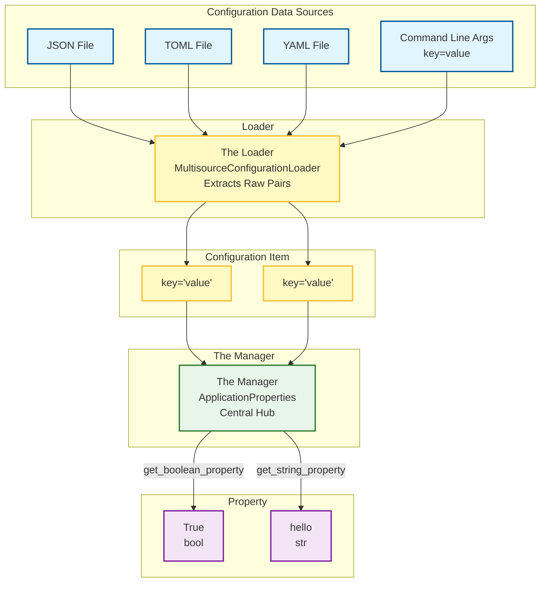

# Quick Start: Introduction

The `application_properties` package is a Python package for managing configuration.
This section contains hands-on guides to help you get started.

These Quick Start guides are not a complete reference. Their focus is on getting
you started quickly, bypassing the need to read the full reference documentation.
These guides provide practical starting points.

The main goal of these guides is simple: provide **quick, clear, and actionable**
steps to get you started using `application_properties`.

Reading this introduction and the linked Quick Start guides takes about 20-30 minutes
and will prepare you to use application_properties in your own projects.
See the [User Guide](../user-guide.md) for deeper details.

## Getting Started: See it in Action

Before diving into concepts, let's see the core functionality in action. The `application_properties`
package loads configuration items from various sources. You can then retrieve properties
from those configuration items as typed Python values. The following example demonstrates
the package's core workflow without diving deep into its full capabilities. It
should provide sufficient context for you to evaluate whether the `application_properties`
meets your configuration needs.

**Before You Start:** To get this example to work on your machine, you need Python
3.10+ and pip installed. (For full requirements to continue with these Quick Start
guides, see the [Prerequisites](#prerequisites) section below.)

Create the file `index_example.py` with the following contents, following the step-by-step
instructions contained within:

```python title="index_example.py" linenums="1"
# Step 0: Ensure the package is installed
# On a command line, type: `pip install application_properties`
 
# Step 1. Create a file named config.json in the same directory with the following content:
#
# {
#   "app_debug": true
# }

from application_properties import ApplicationProperties
from application_properties.multisource_configuration_loader import MultisourceConfigurationLoader

# Step 2. Initialize "The Manager" (ApplicationProperties).
#         This class orchestrates all configuration data.
properties = ApplicationProperties()

# Step 3. Load the data "The Units" from the source file "The Origin" using "The Loader".
#         The MultisourceConfigurationLoader is the standard class for loading data.
MultisourceConfigurationLoader() \
    .add_specified_configuration_file("config.json") \
    .process(properties)

# Step 4. Retrieve "The Result" (typed property) from "The Unit" (Configuration Item).
#         The getter method converts the raw configuration item into a typed boolean property.
is_debugging = properties.get_boolean_property("app_debug")

print(type(is_debugging))  # Output: <class 'bool'>
print(is_debugging)        # Output: True
```

This single block of code demonstrates the entire workflow: Source &rarr; Load &rarr;
Retrieve. This immediate practical example provides context for everything that
follows.

> **Note on Terminology:** Throughout this page, we use specific aliases to simplify
> the mental model of how data moves through the system. The goal of these aliases
> is to help you build a mental model of how the `application_properties` is typically
> used, allowing you to think about how it would integrate with your projects.
>
> - the `ApplicationProperties` class is referred to as **The Manager** because
>   it orchestrates all configuration data.
> - the `MultisourceConfigurationLoader` is referred to as The Loader. This class
>   handles the primary task of loading configuration data from various sources.
> - Configuration files are referred to as **The Origin**. Think of **The Origin**
>   as the 'source of truth' for a specific piece of configuration (e.g., your `config.json`
>   file). It is where the data lives before it enters the system.
> - Individual settings are referred to as **The Units**, representing a pair containing
>   both the name of the pair and the value associated with the pair.
> - Retrieved properties are referred to as **The Result** and are typed Python
>   values, referred to as **properties**.

## Finding Your Path

Select the link below that matches your current goal:

- **I'm just exploring** what `application_properties` is — read the [README File](https://github.com/jackdewinter/application_properties/blob/main/README.md)
  to see a quick overview of the package.

- **I've decided to try** `application_properties` on my project — stay on this
  page to use the `application_properties` package in a sample project and follow
  along with the other Quick Start guides in this series.

- **I'm already using** `application_properties` and want advanced details — jump
  to the [main documentation](../user-guide.md) to read the full configuration
  and reference details.

- **I'm an advanced Python user** who is looking for a minimal setup example —
  follow the [Quick Start: Fast Path for Experienced Python Users](./advanced.md)
  to follow simplified and compressed instructions.

## Core Concepts

To understand the example above, you need to understand the underlying components.
We will break these down step-by-step, moving from raw data to usable Python objects.

> **Terminology Key:** For quick reference, the table below maps core classes to
> their aliases used throughout this documentation.
>
> | Concept | Technical Name | Documentation Alias |
> | :--- | :--- | :--- |
> | Configuration Manager | `ApplicationProperties` | **The Manager** |
> | Configuration Loader | `MultisourceConfigurationLoader` | **The Loader** |
> | Data Source | File (JSON/TOML/YAML) or CLI | **The Origin** |
> | Configuration Item | Raw `key-value` pair | **The Unit** |
> | Typed Property | Retrieved value | **The Result** |

1. **Configuration Data Sources (The Origin):** These are the physical files or
   inputs where configuration data lives (e.g., a file on disk, or an environment
   variable). The package supports loading from:
    - Supported File Formats: JSON, TOML, and YAML files.
    - Alternate Input Sources: The command line in a `key=value` format.
2. **Configuration Loaders (The Loaders):** The component that breaks down the
   **Configuration Data Sources** into a structured and indexable format presented
   to **The Manager**.
    - In this package, the `MultisourceConfigurationLoader` is the standard implementation
      of a Configuration Loader, handling multiple sources simultaneously.
3. **Configuration Item (The Unit):** A Configuration Item is the most basic unit
   of information: a raw `key-value` pair extracted from a source, representing
   the configuration's logical intent.
4. **Property (The Result):** This value is derived from a **Configuration Item**
   via the configuration manager's getters (e.g., fetching `True` instead of the
   string `"True"`).
5. **The Manager (`ApplicationProperties`):** This acts as the central processing
   hub. It accepts data from various sources and transforms raw **Configuration
   Items** into typed **Properties**. Finally, it provides methods (getters) to
   safely retrieve typed Properties.

**Workflow Summary (Conceptual Flow):** [Source: JSON File] &rarr; Loader &rarr;
[Configuration Items] &rarr; Manager &rarr; [Typed Property]



## Foundational Elements (For Deeper Dives)

The `application_properties` package primarily focuses on two concepts:

- **Configuration Loaders:** The components responsible for reading and parsing
  the raw data from a specific Source (e.g., JSON, TOML, YAML). While "Configuration
  Loaders" is the general term for these components, you will primarily interact
  with the `MultisourceConfigurationLoader` for most use cases.
- **Getters:** The methods you call (like `get_boolean_property`) that enforce type
  safety when retrieving the final value, known as a property.

While we explore five layers in [Core Concepts](#core-concepts), these two are essential
for getting started.

These are things you are not expected to know right away, but parts of the package
that will be explained in dedicated deep-dive guides.

## Prerequisites

You don’t need to be a Python expert to use these guides.

### Required

These are the basics you should be comfortable with before using the Quick Start
guides.

- **Built a solid mental model** of how configuration data flows from source to
  typed property using the defined aliases.
- **Successfully loaded a JSON configuration file** and retrieved a typed boolean
  property using the core classes.
- **Identified the correct documentation paths** for installation, advanced loading,
  or validation needs based on your specific goals.

For installation questions, follow through to the next page, [Quick Start: Installation](./installation.md).
It covers when to use `pip`, `pipenv`, or other environment managers.

## Next Steps

**Prerequisites For Going On:** If you followed along with the information in the
Quick Start guide, you have:

- **Built** a solid mental model of how the `application_properties` package orchestrates
  configuration data flow.
- **Executed** a complete configuration workflow by loading a JSON file and retrieving
  a typed boolean property.
- **Selected** your optimal learning path (Exploration, Standard Setup, or Advanced)
  based on your current expertise level.

For a **first-time learner**, a common path through the Quick Start guides is:

<!-- pyml disable-num-lines 9 line-length-->
| Quick Start Page | Description |
| -- | -- |
| [Quick Start: Installation](./installation.md) | Quickly install the package and confirm your environment is ready in under five minutes. |
| [Quick Start: Configuration Loaders](./loaders.md) | Load YAML, JSON, and TOML files in just two function calls — no manual parsing needed. |
| [Quick Start: Configuration Getters](./getters.md) | Safely access properties with automatic type handling and defaults. |
| [Quick Start: Required Fields & Validation](./validation.md) | Enforce required fields and catch configuration errors at startup — before your application is impacted. |
| [Quick Start: Configuration Data Layering](./layering.md) | Merge multiple configuration sources, letting environment-specific values automatically override defaults. |
| [Quick Start: Configuration Hierarchy](./hierarchy.md) | Organize nested settings like a file system, enabling easy access via dot-path queries (e.g., `app.server.port`) |
| [Quick Start: Type Inference For Manual Properties](./manual.md) | Prevent silent bugs using strict type casting and automatic type conversion (e.g., strings to ints) for manually defined properties. |

**If you have solid Python skills** and just want to try `application_properties`
out as efficiently as possible:

<!-- pyml disable-num-lines 4 no-inline-html-->
<!-- pyml disable-num-lines 3 line-length-->
| Quick Start Page | Description |
| -- | -- |
| [Quick Start: Fast Path for Experienced Python Users](./advanced.md)<br>(Assumes you know how to configure Python environments.) | Getting started with the `application_properties` package. |
