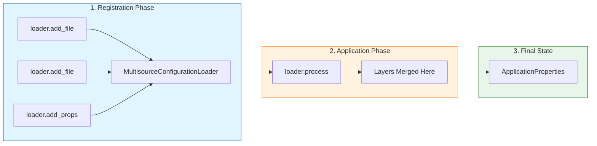

# Quick Start: Configuration Data Layering

This guide explores layering — merging values from multiple sources where later
values override earlier ones — to simplify your configuration workflow.

## What You Will Learn

On this page, you will master the mechanics of configuration layering by learning
to:

- **Identify** the appropriate configuration sources (files, command-line arguments,
  or custom objects) that fit your project's needs.
- **Configure** the `MultisourceConfigurationLoader` by registering multiple sources
  and intentionally ordering them to establish precedence.
- **Execute** the layering process by calling the `process` method to merge all
  registered sources into a single `ApplicationProperties` object.
- **Handle** potential loading errors gracefully by implementing custom error handlers
  to prevent silent failures or application crashes.

> **Scope Note:** This guide focuses on **layering** (merging values from multiple
> sources, where later values override earlier ones) rather than **hierarchy**
> (grouping keys into namespaces), which is covered in the [next guide](./hierarchy.md).

## Prerequisites

This Quick Start guide builds upon the foundations established in
[Quick Start: Configuration Loaders](./loaders.md). Specifically, you should be
comfortable with initializing an `ApplicationProperties` object and using the `MultisourceConfigurationLoader`
class to add a single configuration file.
Given that you already know how to load a single configuration file, we will learn
how to load configuration data from multiple files
and how those configuration files interact with each other.

Now that we have the prerequisites, we will introduce the primary tool for layering:
the `MultisourceConfigurationLoader` class.

## The `MultisourceConfigurationLoader` Class

The `MultisourceConfigurationLoader` class is a helper class designed to ingest
configuration data from various sources (such as files, command-line arguments,
or custom objects) and merge them into a single `ApplicationProperties` object.
It provides five specific `add_` methods to register these sources and a `process`
method to apply them in order.

### Five Helper Methods to Load Configuration Data

To demonstrate layering, we build upon the basic loader setup established in the
[Configuration Loaders guide](./loaders.md#the-recommended-approach).

<!-- pyml disable-num-lines 2 no-inline-html-->
<details>
<summary>Click to see the Base Setup (from previous guide)</summary>

```python title="loaders_multisource.py" linenums="1"
from application_properties import ApplicationProperties
from application_properties.multisource_configuration_loader import MultisourceConfigurationLoader, ConfigurationFileType

properties = ApplicationProperties()
loader = MultisourceConfigurationLoader()
loader.add_specified_configuration_file(
    "sample.yaml",
    ConfigurationFileType.YAML,
)
if loader.process(properties):
    raise ValueError("Configuration loading failed")
```

</details>

There are actually five different methods that the `MultisourceConfigurationLoader`
class can use to **load** configuration data. While the `add_specified_configuration_file`
method is just one option, here are all five:

<!-- pyml disable-num-lines 7 line-length-->
| Method Name                         | Data Type | Details |
| :---                                   | :--- | :--- |
| `add_local_pyproject_toml_file`       | TOML | Only if file exists. |
| `add_local_project_configuration_file`| JSON,TOML,YAML | Only if file exists. |
| `add_specified_configuration_file`    | JSON,TOML,YAML | File must exist. |
| `add_manually_set_properties`         | `key=value` | Special format for `int` and `bool`. |
| `add_custom_source`                   | custom | N/A |

The two `add_local` methods are special in that they only load the configuration
data if
the specified exists. This is an important consideration when supporting local "project"
files that may not be there, such as a `pyproject.toml` file or a `my_app.yaml`
file in the
root directory of the project.

The `add_specified_configuration_file` method accepts either a full filename
(e.g., `"file.json"`) or a base name (e.g., `"my_app_config"`). When using a full
filename, the method attempts to load it directly. If that fails, it searches for
a content match.

> **NOTE:** This flexible approach mimics common tools like `.coveragerc` and `.flake8`,
> which also support multiple naming conventions.

The remaining two methods are generic entry points for custom or manual data sources.
The `add_manually_set_properties` method accepts
an optional list of strings, meant to facilitate passing configuration item `key-value`
pairs
collected from the command line. (We dive deeper into the use of this method on
the last page of our series,
[Quick Start: Setting Properties Manually and Type Inference](./manual.md).)
The last method, the `add_custom_source` method, is the wildcard for any configuration
source that does not match the built-in types.
To use this method, you must create a class that inherits from the `BaseConfigurationSource`
class. You must then implement its `apply_configuration` method.
This allows you to load configuration from databases, APIs, or other custom locations.
This guide does not cover examples of this method. For details, see
[Custom Configuration Data Loaders](../custom.md#custom-configuration-data-loaders).

We use the `add_specified_configuration_file` method for this initial example because
its explicit ordering makes the layering precedence rules easiest to visualize.
The **last-one-wins** logic applies identically regardless of whether you mix `add_manually_set_properties`,
`add_custom_source`, or file-based loaders. For ease of explanation, we start with
a single method to isolate the core layering behavior from the complexity of type
merging.
This approach ensures you understand the foundational precedence model before navigating
mixed-source scenarios.

### Loading Data From Multiple Files

In real-world scenarios, applications often pull configuration from multiple files.
For example, an application might load both the `pyproject.toml` file and the `my-configuration.yaml`
file. When multiple data sources are involved, clear rules are needed to determine
how they are processed.

For this example, ensure that the base `sample.yaml` file has the contents:

```yaml title="sample.yaml" linenums="1"
log-level: "INFO"
log-file: mylog.log
log-rotate-length: 10000
valid-extensions: ".json,.yml,.yaml,.toml"
```

and create a new `other-sample.yaml` file in the same directory with the contents:

```yaml title="other-sample.yaml" linenums="1"
log-level: "DEBUG"
something-else: 42
```

> Note: The `log-rotate-each-day` key is intentionally omitted from both the `sample.yaml`
> file and the `other-sample.yaml` file to demonstrate the behavior of the `ApplicationProperties`
> object when a requested value is not present in any layer.

Using the `getters_string_list_unified.py` example from the [Unified Python Implementation](./getters.md#unified-python-implementation)
section of the "Getters" page as a template,
create the `layering_multiple_sources.py` file that adds another `add_specified_configuration_file`
method call after the existing method call and right before the `process` method
call:

```python title="layering_multiple_sources.py" linenums="1"
from application_properties import ApplicationProperties
from application_properties.multisource_configuration_loader import MultisourceConfigurationLoader, ConfigurationFileType

properties = ApplicationProperties()
loader = MultisourceConfigurationLoader()
loader.add_specified_configuration_file(
    "sample.yaml",
    ConfigurationFileType.YAML,
)
loader.add_specified_configuration_file(
    "other-sample.yaml",
    ConfigurationFileType.YAML,
)
if loader.process(properties):
    raise ValueError("Configuration loading failed")

print(f"log-level           = {properties.get_string_property('log-level')}")
print(f"log-rotate-length   = {properties.get_integer_property('log-rotate-length')}")
print(f"log-rotate-each-day = {properties.get_boolean_property('log-rotate-each-day')}")
print(f"valid-extensions    = {properties.get_string_list_property('valid-extensions', ',')}")
```

In typical use cases, the extra `add_specified_configuration_file` method call could
not only be any one of the
`add_` methods, it could also be multiple `add_` methods.
But to keep things simple, this guide focuses on the one added method corresponding
to our new `other-sample.yaml` file.

For now, we will use the default error handling. We will explore how to customize
error handling later in this guide to make your configuration loading more robust.

What happens when the `layering_multiple_sources.py` file is executed and both are
applied?

### Understanding Layering

It is critical to understand that configuration loading happens in two distinct
phases:

- **Registration:** You define the sources using `add_` methods. At this stage,
  no data is loaded yet; the loader simply remembers the order of sources.
- **Application:** You call the `process` method. This is when the loader merges
  the registered sources in order.
- **Final State:** The final values are applied to the `ApplicationProperties` object.



In our specific example, this process looks like this:

1. The `sample.yaml` file is loaded first, creating four initial configuration items
   in-memory.
2. The `other-sample.yaml` file is loaded second. It overrides the `log-level` configuration
   item, and adds the new `something-else` configuration item.
3. The in-memory configurations are loaded into the `ApplicationProperties` object.

**Important:** The `add_` methods only *register* the configuration sources. They
do not apply them yet. The configuration data is **not loaded** into the `ApplicationProperties`
object until you explicitly call the `process` method. This method acts as the commit
point, loading all registered sources in the order they were added and applying
the final layered configuration to the properties object.

Our team finds it useful to think about these things in a table format:

<!-- pyml disable-num-lines 7 line-length-->
| Configuration Item | `sample.yaml` |`other-sample.yaml`|Final Value |
| :-- | :--- | :-- | :-- |
| `log-level` | "INFO" | "DEBUG" | "DEBUG" |
| `log-file` | "mylog.log" | N/A | "mylog.log" |
| `log-rotate-length` | 10000 | N/A | 10000 |
| `valid-extensions` | ".json,.yml,.yaml,.toml" | N/A | ".json,.yml,.yaml,.toml" |
| `something-else` | N/A | 42 | 42 |

The `sample.yaml` and `other-sample.yaml` columns show the values defined by each
source. These columns are ordered to match the sequence of `add_specified_configuration_file`
calls in the `layering_multiple_sources.py` file. The `Final Value` column is simply
the right-most value of those two columns.

This behavior applies to both scalars (booleans, integers, and string) and collections
(string lists).
To be clear, string lists are considered to be a single configuration item, and
therefore the entire string list is replaced.

For instance, if the `sample.yaml` file specifies a value as `["a", "b"]` and the
`other-sample.yaml` file specifies the same key as ["c"],
the `ApplicationProperties` object will contain the value `["c"]`.

**Critical Rule:** The order of precedence is strictly determined by the order in
which the `add_` methods are called. The last method to register a specific key
wins, regardless of the method type. For example, if you call the `add_specified_configuration_file`
method *after* the `add_manually_set_properties` method, the values in the configuration
file will **override** the manually set properties, even though the method name
suggests manual input is "higher priority." Always design your layering order intentionally
to ensure the `ApplicationProperties` object receives the intended configuration
values.

This table format approach provides a simple but honest summarization of what your
configuration data sources
will look like when applied by your application.

Now that we understand the basic 'last one wins' rule, let's look at how real-world
applications combine multiple layer types.

## Structuring Layering in Practice

You can mix different `add_` methods to create a custom layering strategy. For example,
[PyMarkdown](https://github.com/jackdewinter/pymarkdown) implements its configuration
loading with the following order:

```python title="layering_pymarkdown_example.py" linenums="1"
loader = MultisourceConfigurationLoader()

# 1. Lowest Priority: Defaults from pyproject.toml
loader.add_local_pyproject_toml_file()

# 2. Project-specific overrides
loader.add_local_project_configuration_file()

# 3. Command-line specified config (if present)
if config_file:
    loader.add_specified_configuration_file(config_file)

# 4. Highest Priority: Command-line arguments
loader.add_manually_set_properties(args.properties)
```

In this example:

- the `pyproject.toml` file provides default values
- the `.my-project.yaml` file overrides those defaults for the project
- the command-line config file overrides both if present
- command-line arguments provide the final, highest-priority values

**Result:** By placing the `add_manually_set_properties` call last, the code guarantees
that command-line flags (Highest Priority) will always overwrite defaults from the
`pyproject.toml` file (Lowest Priority).

This approach ensures that specific, temporary overrides (like command-line flags)
always take precedence over stored configuration files.

Layering offers significant configuration flexibility, but it also introduces specific
risks. If a later layer fails to load, the loader may leave earlier layers partially
applied, leaving the application in an unexpected state. Also, silent failures
in one layer can mask issues in others, making debugging more difficult. To handle
these risks, we need robust error handling to ensure your application responds gracefully
to missing or malformed configuration files, rather than failing silently or crashing.

### Making Layering Robust: Error Handling

Now that we understand how configuration data is layered and prioritized, it's important
to consider what happens when one of those layers fails to load.

Configuration data often fails to conform to the expected format standards. For
example, a single extra comma in a JSON file can cause a load failure. By default,
the `process` method writes error information to standard out (`stdout`).

Depending on your application, you may want to print more information when an error
occurs or send that information to a different destination, such as standard error
(`stderr`) or a log file. The `handle_error_fn` parameter was added to the process
method to facilitate this flexibility.

This next example builds up the `layering_multiple_sources.py` file from above to
create the `layering_error_handling.py` file.
The new file adds a new `print_error_to_stdout` method to the file. To make sure
it is used, the
`process(properties)` method call is changed to `process(properties, print_error_to_stdout)`.

```python title="layering_error_handling.py"  linenums="1"
from typing import Optional
import sys
from application_properties import ApplicationProperties
from application_properties.multisource_configuration_loader import MultisourceConfigurationLoader, ConfigurationFileType

def print_error_to_stdout(formatted_error: str, thrown_exception: Optional[Exception]) -> None:
    print(f">{formatted_error}<", file=sys.stderr)

properties = ApplicationProperties()
loader = MultisourceConfigurationLoader()
loader.add_specified_configuration_file(
    "sample.yaml",
    ConfigurationFileType.YAML,
)
loader.add_specified_configuration_file(
    "other-sample.yaml",
    ConfigurationFileType.YAML,
)
if loader.process(properties, print_error_to_stdout):
    raise ValueError("Configuration loading failed")

print(f"log-level           = {properties.get_string_property('log-level')}")
print(f"log-rotate-length   = {properties.get_integer_property('log-rotate-length')}")
print(f"log-rotate-each-day = {properties.get_boolean_property('log-rotate-each-day')}")
print(f"valid-extensions    = {properties.get_string_list_property('valid-extensions', ',')}")
```

When you execute the script, nothing different happens because we have used the
`sample.yaml`
file before and it loads properly. To simulate an error, intentionally change either
occurrence of `ConfigurationFileType.YAML` to `ConfigurationFileType.JSON` in the
`layering_error_handling.py` file. This change forces the JSON parser to read the
YAML file, causing a predictable failure. Since both the `sample.yaml` file and
the `other-sample.yaml` file contain YAML syntax, the JSON parser will fail:

```text title="Standard Output"
>Specified configuration file 'sample.yaml' is not a valid JSON file: Expecting value: line 1 column 1 (char 0).<
log-level           = None
log-rotate-length   = None
log-rotate-each-day = None
valid-extensions    = None
```

The `print_error_to_stdout` function writes the error text to `stderr` and surrounds
it with `>` and `<` delimiters. These delimiters are added intentionally to make
the custom error lines easily identifiable in the console output.

However, this handler is just one example. You could just as easily use the `logging`
package to log the failure, write it directly to a log file, or implement any other
behavior.

**Why is this important for layering?** When loading configuration from multiple
sources, the likelihood of one source failing increases. Proper error handling
ensures that your application can respond gracefully to missing or malformed configuration
files, rather than failing silently or crashing.

## Next Steps

**Prerequisites For Going On:** If you followed along with the information in the
Quick Start guide, you have:

- **Distinguished** the two distinct phases of loading: registration via `add_`
  methods and the final merge committed by `process`.
- **Applied** strict precedence rules where the last registered source for a key
  always overrides previous values.
- **Choosing and Ordering** appropriate configuration sources (files, CLI args,
  or custom objects) to establish a clear and intentional configuration hierarchy.
- **Implemented** custom error handlers to manage potential failures and prevent
  silent configuration errors.

**Next**, in the Quick Start guide series:

- Use [Quick Start: Configuration Hierarchy](./hierarchy.md) to organize nested
  settings like a file system, enabling easy access via dot-path queries (e.g.,
 `app.server.port`).

**If** you need some review, select one of the items below:

<!-- pyml disable-num-lines 10 line-length-->
| Quick Start Page | Description |
| -- | -- |
| [Quick Start: Introduction](./index.md) | Understand the package's architecture and find the right learning path for your needs. |
| [Quick Start: Installation](./installation.md) | Quickly install the package and confirm your environment is ready in under five minutes. |
| [Quick Start: Configuration Loaders](./loaders.md) | Load YAML, JSON, and TOML files in just two function calls — no manual parsing needed. |
| [Quick Start: Configuration Getters](./getters.md) | Safely access properties with automatic type handling and defaults. |
| [Quick Start: Required Fields & Validation](./validation.md) | Enforce required fields and catch configuration errors at startup — before your application is impacted. |
